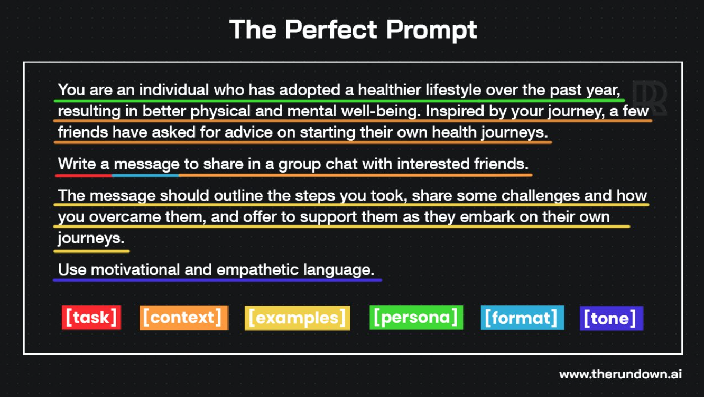
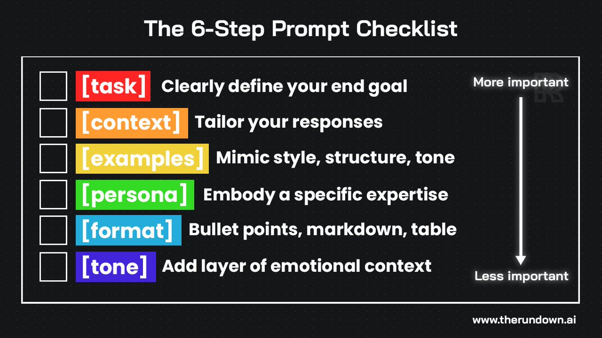

# Prompt Engineering

## Rowan's "Perfect Prompt"

Source: https://twitter.com/rowancheung/status/1718985386267906265

Not all steps are essential, but focusing on the more important steps (in order) should be a priority.

## Questions

These three key questions can help guide you in the right direction:

1. What's the user's background?
2. What does success look like?
3. What environment are they in?