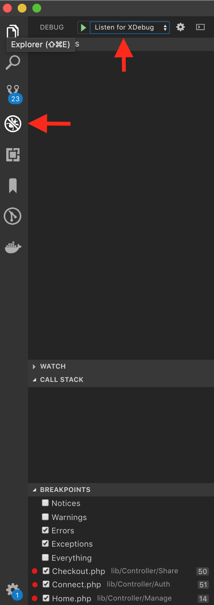

## Debugging php with xdebug in a docker container

### Problem

We need to debug a PHP application running inside a local docker container. We do not want to add an extra network sevice like SSH into the container, and will intentionally avoid manually running commands from the container shell environment.

### Steps

#### 1: Setting up the app environment

In order to better separate builds ready for QA and Production, we will build a new debugging container from the app container so that insecure services like xdebug are never built in to the wrong container.

```dockerfile
FROM mashiox/my-container:latest

RUN apt-get install -y net-tools \
    && pecl install xdebug 
COPY ./build/config/php/xdebug.ini /usr/local/etc/php/conf.d/
```

```bash
docker build -t mashiox/my-debug-container -f ./Dockerfile ../..
```

If you used my configuration, Xdebug will now run in the container and will autostart with when the PHP engine starts. It is also listening for connections from a host at the address `10.254.254.254` on port `9001`.

You can reconfigure these values to be whatever is appropriate for your host's network. [In OS X there is something behaviorally wrong with the way the host's IP is accessed by the container,](https://forums.docker.com/t/ip-address-for-xdebug/10460) so in order to make the host's IP address something I can predict, I manually alias my `en0` device to this address so that Xdebug can connect to vscode. On Linux/Windows WSL, I think you can probably just set the address to whatever your network address is. I believe it is normally `172.17.0.1`.

#### 2: Setting up the development environment

VSCode needs an extension to work with xdebug. I use [`vscode-php-debug`](https://marketplace.visualstudio.com/items?itemName=felixfbecker.php-debug). 

The port numbers need to match the configuration that was given to xdebug in the app environment. Other than that, you configure `vscode-php-debug` to watch the right file paths so that VSCode can debug the cooresponding code files. If you used my configuration in `launch.json`, you'll notice everything is listening on port `9001`.

When `launch.json` is in the `.vscode/` directory in the project root, you'll find "Listen for XDebug" in the dropdown of the debug module



Example launch.json path mappings config.
```json
"pathMappings": {
    "/path/to/file/in/docker/environent.php": "${workspaceRoot}/environment.php",


    "/opt/example.com/boot.php": "${workspaceRoot}/boot.php",
    "/opt/example.com/lib": "${workspaceRoot}/lib",


    "/opt/example.com/": "${workspaceRoot}/boot.php",

}
```

Launch the xdebug listener while the container is running and code fast!

#### Remote Server Configuration (Requires SSH)

```ini
zend_extension=xdebug.so
; zend_extension=/usr/lib/php/20151012/xdebug.so
xdebug.remote_enable=1
xdebug.remote_host=localhost
xdebug.remote_port=9001
xdebug.remote_autostart=1
xdebug.remote_log=/tmp/xdebug_log/xdebug.log

xdebug.idekey=VSCODE
;xdebug.scream=1
```

```apache2
php_value zend_extension=xdebug.so
php_value xdebug.remote_enable=1
php_value xdebug.remote_host=localhost
php_value xdebug.remote_port=9001
php_value xdebug.remote_autostart=1
php_value xdebug.remote_log=/tmp/xdebug_log/xdebug.log

php_value xdebug.idekey=VSCODE
```

Shell into remote server:

You must map your listening port to the ports listening on the server.

```bash
ssh -R 9001:localhost:9001 user@server
```

### Helpful Configuration

xdebug Session Start Query String
`?XDEBUG_SESSION_START=wt`

## References

* [IP Address for XDebug](https://forums.docker.com/t/ip-address-for-xdebug/10460) *Docker IP on OS X issue*
* [A similar tutorial](https://gist.github.com/chadrien/c90927ec2d160ffea9c4)
* `vscode-php-debug` from @felixfbecker
  * VSCode Marketplace https://marketplace.visualstudio.com/items?itemName=felixfbecker.php-debug
  * GitHub https://github.com/felixfbecker/vscode-php-debug